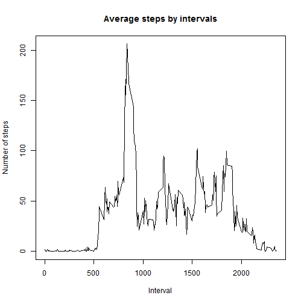
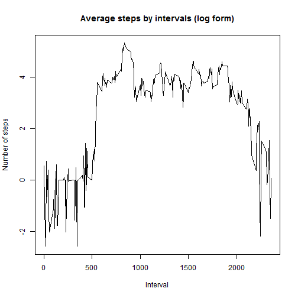

This is an R Markdown document. Markdown is a simple formatting syntax for authoring HTML, PDF, and MS Word documents. For more details on using R Markdown see <http://rmarkdown.rstudio.com>.

When you click the **Knit** button a document will be generated that includes both content as well as the output of any embedded R code chunks within the document. You can embed an R code chunk like this:


```r
##########Loading and preprocessing the data#############################################

lct <- Sys.getlocale("LC_TIME"); Sys.setlocale("LC_TIME", "C")
```

```
## [1] "C"
```

```r
#setting working directory  

setwd("C:\\Users\\puldor\\Desktop\\Coresera\\Rep_Prod_Res")

activity <- read.csv("activity.csv", na.string="NA", header=TRUE , stringsAsFactors=F)

str(activity)
```

```
## 'data.frame':	17568 obs. of  3 variables:
##  $ steps   : int  NA NA NA NA NA NA NA NA NA NA ...
##  $ date    : chr  "2012-10-01" "2012-10-01" "2012-10-01" "2012-10-01" ...
##  $ interval: int  0 5 10 15 20 25 30 35 40 45 ...
```

```r
activity$date <- as.Date(activity$date, "%Y-%m-%d")

str(activity)
```

```
## 'data.frame':	17568 obs. of  3 variables:
##  $ steps   : int  NA NA NA NA NA NA NA NA NA NA ...
##  $ date    : Date, format: "2012-10-01" "2012-10-01" ...
##  $ interval: int  0 5 10 15 20 25 30 35 40 45 ...
```

```r
#########Q1. What is mean total number of steps taken per day?#########################

daily_sum <- rowsum(activity$steps, activity$date, reorder = TRUE, na.rm = FALSE)

hist(daily_sum, xlab = "Total number of steps taken each day", ylab = "Frequency",plot= TRUE,  main = "Mean number of steps each day")
```

 

```r
#dev.copy(png,file='./mean_steps_day.png',width=480,height=480) 

#Calculate and report the mean 
daily_mean <- aggregate(activity$steps, by=list(Date=activity$date), FUN=mean, na.rm=TRUE)

colnames(daily_mean) <- c("Date", "Mean number of steps")

print(daily_mean)
```

```
##          Date Mean number of steps
## 1  2012-10-01                  NaN
## 2  2012-10-02               0.4375
## 3  2012-10-03              39.4167
## 4  2012-10-04              42.0694
## 5  2012-10-05              46.1597
## 6  2012-10-06              53.5417
## 7  2012-10-07              38.2465
## 8  2012-10-08                  NaN
## 9  2012-10-09              44.4826
## 10 2012-10-10              34.3750
## 11 2012-10-11              35.7778
## 12 2012-10-12              60.3542
## 13 2012-10-13              43.1458
## 14 2012-10-14              52.4236
## 15 2012-10-15              35.2049
## 16 2012-10-16              52.3750
## 17 2012-10-17              46.7083
## 18 2012-10-18              34.9167
## 19 2012-10-19              41.0729
## 20 2012-10-20              36.0938
## 21 2012-10-21              30.6285
## 22 2012-10-22              46.7361
## 23 2012-10-23              30.9653
## 24 2012-10-24              29.0104
## 25 2012-10-25               8.6528
## 26 2012-10-26              23.5347
## 27 2012-10-27              35.1354
## 28 2012-10-28              39.7847
## 29 2012-10-29              17.4236
## 30 2012-10-30              34.0938
## 31 2012-10-31              53.5208
## 32 2012-11-01                  NaN
## 33 2012-11-02              36.8056
## 34 2012-11-03              36.7049
## 35 2012-11-04                  NaN
## 36 2012-11-05              36.2465
## 37 2012-11-06              28.9375
## 38 2012-11-07              44.7326
## 39 2012-11-08              11.1771
## 40 2012-11-09                  NaN
## 41 2012-11-10                  NaN
## 42 2012-11-11              43.7778
## 43 2012-11-12              37.3785
## 44 2012-11-13              25.4722
## 45 2012-11-14                  NaN
## 46 2012-11-15               0.1424
## 47 2012-11-16              18.8924
## 48 2012-11-17              49.7882
## 49 2012-11-18              52.4653
## 50 2012-11-19              30.6979
## 51 2012-11-20              15.5278
## 52 2012-11-21              44.3993
## 53 2012-11-22              70.9271
## 54 2012-11-23              73.5903
## 55 2012-11-24              50.2708
## 56 2012-11-25              41.0903
## 57 2012-11-26              38.7569
## 58 2012-11-27              47.3819
## 59 2012-11-28              35.3576
## 60 2012-11-29              24.4688
## 61 2012-11-30                  NaN
```

```r
#Calculate and report the median

daily_median <- aggregate(activity$steps, by=list(Date=activity$date), FUN=median, na.rm=TRUE)

colnames(daily_median) <- c("Date", "Median number of steps")

print(daily_median)
```

```
##          Date Median number of steps
## 1  2012-10-01                     NA
## 2  2012-10-02                      0
## 3  2012-10-03                      0
## 4  2012-10-04                      0
## 5  2012-10-05                      0
## 6  2012-10-06                      0
## 7  2012-10-07                      0
## 8  2012-10-08                     NA
## 9  2012-10-09                      0
## 10 2012-10-10                      0
## 11 2012-10-11                      0
## 12 2012-10-12                      0
## 13 2012-10-13                      0
## 14 2012-10-14                      0
## 15 2012-10-15                      0
## 16 2012-10-16                      0
## 17 2012-10-17                      0
## 18 2012-10-18                      0
## 19 2012-10-19                      0
## 20 2012-10-20                      0
## 21 2012-10-21                      0
## 22 2012-10-22                      0
## 23 2012-10-23                      0
## 24 2012-10-24                      0
## 25 2012-10-25                      0
## 26 2012-10-26                      0
## 27 2012-10-27                      0
## 28 2012-10-28                      0
## 29 2012-10-29                      0
## 30 2012-10-30                      0
## 31 2012-10-31                      0
## 32 2012-11-01                     NA
## 33 2012-11-02                      0
## 34 2012-11-03                      0
## 35 2012-11-04                     NA
## 36 2012-11-05                      0
## 37 2012-11-06                      0
## 38 2012-11-07                      0
## 39 2012-11-08                      0
## 40 2012-11-09                     NA
## 41 2012-11-10                     NA
## 42 2012-11-11                      0
## 43 2012-11-12                      0
## 44 2012-11-13                      0
## 45 2012-11-14                     NA
## 46 2012-11-15                      0
## 47 2012-11-16                      0
## 48 2012-11-17                      0
## 49 2012-11-18                      0
## 50 2012-11-19                      0
## 51 2012-11-20                      0
## 52 2012-11-21                      0
## 53 2012-11-22                      0
## 54 2012-11-23                      0
## 55 2012-11-24                      0
## 56 2012-11-25                      0
## 57 2012-11-26                      0
## 58 2012-11-27                      0
## 59 2012-11-28                      0
## 60 2012-11-29                      0
## 61 2012-11-30                     NA
```

```r
#########Q2.What is the average daily activity pattern?###############################

mean_inter <- aggregate(activity$steps, by=list(Interval=activity$interval), FUN=mean,  na.rm=TRUE)

colnames(mean_inter) <- c("Interval", "N_steps")

plot(mean_inter$Interval, mean_inter$N_steps, type="l", xlab="Interval", ylab="Number of steps")
title(main = "Average steps by intervals")
```

 

```r
#dev.copy(png,file='./mean_steps_intervals.png',width=480,height=480) 

#The same thing but in log file

mean_inter$N_steps[mean_inter$N_steps==0] <- 1

mean_inter$N_steps1 <- log(mean_inter$N_steps)

plot(mean_inter$Interval, mean_inter$N_steps1, type="l", xlab="Interval", ylab="Number of steps")
title(main = "Average steps by intervals (log form)")
```

 

```r
#dev.copy(png,file='./mean_steps_intervals_log.png',width=480,height=480) 


#Which 5-minute interval, on average across all the days in the dataset, contains the maximum number of steps?

max_step_int <- max(activity$steps, na.rm=TRUE)
step_max <- subset(activity, activity$steps == max_step_int, na.rm=TRUE)
print(step_max[,1-3])
```

```
##       steps interval
## 16492   806      615
```

```r
#########Q3. Imputing missing values###################################################

#Calculate and report the total number of missing values in the dataset (i.e. the total number of rows with NAs)

NaN_sum <- colSums(is.na(activity))
print(NaN_sum)
```

```
##    steps     date interval 
##     2304        0        0
```

```r
# Devise a strategy for filling in all of the missing values in the dataset. 
####I go with the simplest method - filling NAs with mean number for whole dataset 

mean_all <- mean(activity$steps, na.rm=TRUE)

#Create a new dataset that is equal to the original dataset but with the missing data filled in.

new_activity <- activity
new_activity[is.na(new_activity <- activity)] <- mean_all

#Make a histogram of the total number of steps taken each day and Calculate and report the mean and median total number of steps taken per day

hist(new_activity$steps)
```

 

```r
#dev.copy(png,file='./mean_steps_day_new.png',width=480,height=480)

#mean

daily_mean_new <- aggregate(new_activity$steps, by=list(Date=new_activity$date), FUN=mean, na.rm=TRUE)

colnames(daily_mean_new) <- c("Date", "Mean number of steps")

print (daily_mean_new)
```

```
##          Date Mean number of steps
## 1  2012-10-01              37.3826
## 2  2012-10-02               0.4375
## 3  2012-10-03              39.4167
## 4  2012-10-04              42.0694
## 5  2012-10-05              46.1597
## 6  2012-10-06              53.5417
## 7  2012-10-07              38.2465
## 8  2012-10-08              37.3826
## 9  2012-10-09              44.4826
## 10 2012-10-10              34.3750
## 11 2012-10-11              35.7778
## 12 2012-10-12              60.3542
## 13 2012-10-13              43.1458
## 14 2012-10-14              52.4236
## 15 2012-10-15              35.2049
## 16 2012-10-16              52.3750
## 17 2012-10-17              46.7083
## 18 2012-10-18              34.9167
## 19 2012-10-19              41.0729
## 20 2012-10-20              36.0938
## 21 2012-10-21              30.6285
## 22 2012-10-22              46.7361
## 23 2012-10-23              30.9653
## 24 2012-10-24              29.0104
## 25 2012-10-25               8.6528
## 26 2012-10-26              23.5347
## 27 2012-10-27              35.1354
## 28 2012-10-28              39.7847
## 29 2012-10-29              17.4236
## 30 2012-10-30              34.0938
## 31 2012-10-31              53.5208
## 32 2012-11-01              37.3826
## 33 2012-11-02              36.8056
## 34 2012-11-03              36.7049
## 35 2012-11-04              37.3826
## 36 2012-11-05              36.2465
## 37 2012-11-06              28.9375
## 38 2012-11-07              44.7326
## 39 2012-11-08              11.1771
## 40 2012-11-09              37.3826
## 41 2012-11-10              37.3826
## 42 2012-11-11              43.7778
## 43 2012-11-12              37.3785
## 44 2012-11-13              25.4722
## 45 2012-11-14              37.3826
## 46 2012-11-15               0.1424
## 47 2012-11-16              18.8924
## 48 2012-11-17              49.7882
## 49 2012-11-18              52.4653
## 50 2012-11-19              30.6979
## 51 2012-11-20              15.5278
## 52 2012-11-21              44.3993
## 53 2012-11-22              70.9271
## 54 2012-11-23              73.5903
## 55 2012-11-24              50.2708
## 56 2012-11-25              41.0903
## 57 2012-11-26              38.7569
## 58 2012-11-27              47.3819
## 59 2012-11-28              35.3576
## 60 2012-11-29              24.4688
## 61 2012-11-30              37.3826
```

```r
#meadian

daily_median_new <- aggregate(new_activity$steps, by=list(Date=new_activity$date), FUN=median, na.rm=TRUE)

colnames(daily_median_new) <- c("Date", "Median number of steps")

print(daily_median_new)
```

```
##          Date Median number of steps
## 1  2012-10-01                  37.38
## 2  2012-10-02                   0.00
## 3  2012-10-03                   0.00
## 4  2012-10-04                   0.00
## 5  2012-10-05                   0.00
## 6  2012-10-06                   0.00
## 7  2012-10-07                   0.00
## 8  2012-10-08                  37.38
## 9  2012-10-09                   0.00
## 10 2012-10-10                   0.00
## 11 2012-10-11                   0.00
## 12 2012-10-12                   0.00
## 13 2012-10-13                   0.00
## 14 2012-10-14                   0.00
## 15 2012-10-15                   0.00
## 16 2012-10-16                   0.00
## 17 2012-10-17                   0.00
## 18 2012-10-18                   0.00
## 19 2012-10-19                   0.00
## 20 2012-10-20                   0.00
## 21 2012-10-21                   0.00
## 22 2012-10-22                   0.00
## 23 2012-10-23                   0.00
## 24 2012-10-24                   0.00
## 25 2012-10-25                   0.00
## 26 2012-10-26                   0.00
## 27 2012-10-27                   0.00
## 28 2012-10-28                   0.00
## 29 2012-10-29                   0.00
## 30 2012-10-30                   0.00
## 31 2012-10-31                   0.00
## 32 2012-11-01                  37.38
## 33 2012-11-02                   0.00
## 34 2012-11-03                   0.00
## 35 2012-11-04                  37.38
## 36 2012-11-05                   0.00
## 37 2012-11-06                   0.00
## 38 2012-11-07                   0.00
## 39 2012-11-08                   0.00
## 40 2012-11-09                  37.38
## 41 2012-11-10                  37.38
## 42 2012-11-11                   0.00
## 43 2012-11-12                   0.00
## 44 2012-11-13                   0.00
## 45 2012-11-14                  37.38
## 46 2012-11-15                   0.00
## 47 2012-11-16                   0.00
## 48 2012-11-17                   0.00
## 49 2012-11-18                   0.00
## 50 2012-11-19                   0.00
## 51 2012-11-20                   0.00
## 52 2012-11-21                   0.00
## 53 2012-11-22                   0.00
## 54 2012-11-23                   0.00
## 55 2012-11-24                   0.00
## 56 2012-11-25                   0.00
## 57 2012-11-26                   0.00
## 58 2012-11-27                   0.00
## 59 2012-11-28                   0.00
## 60 2012-11-29                   0.00
## 61 2012-11-30                  37.38
```

```r
#########Q4.  Are there differences in activity patterns between weekdays and weekends?

activity$weekday <- weekdays(activity$date) 

activity$wd[activity$weekday=="Monday"] <- "weekday"
activity$wd[activity$weekday=="Tuesday"] <- "weekday"
activity$wd[activity$weekday=="Wednesday"] <- "weekday"
activity$wd[activity$weekday=="Wednesday"] <- "weekday"
activity$wd[activity$weekday=="Thursday"] <- "weekday"
activity$wd[activity$weekday=="Friday"] <- "weekday"
activity$wd[activity$weekday=="Saturday"] <- "weekend"
activity$wd[activity$weekday=="Sunday"] <- "weekend"

activity$wd <- factor(activity$wd)

mean_inter_wd <- aggregate(activity$steps, by=list(Interval=activity$interval, weekday = activity$wd), FUN=mean,  na.rm=TRUE)

mean_inter_wd$x[mean_inter_wd$x==0] <- 1

mean_inter_wd$x <- log(mean_inter_wd$x)

library(lattice)
xyplot(x ~ Interval | weekday, data =mean_inter_wd, type= "l", layout = c(1, 2), ylab = "Number of steps")
```

 

```r
#dev.copy(png,file='./mean_steps_intervals_wk.png',width=480,height=480) 

######### THE END ############################################################################
```
